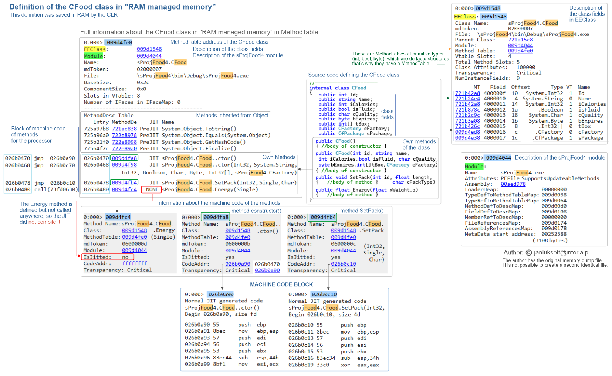
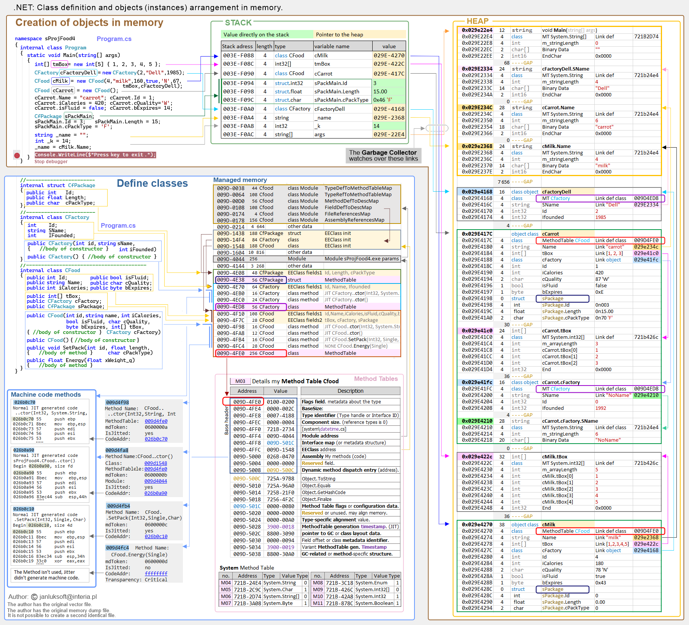
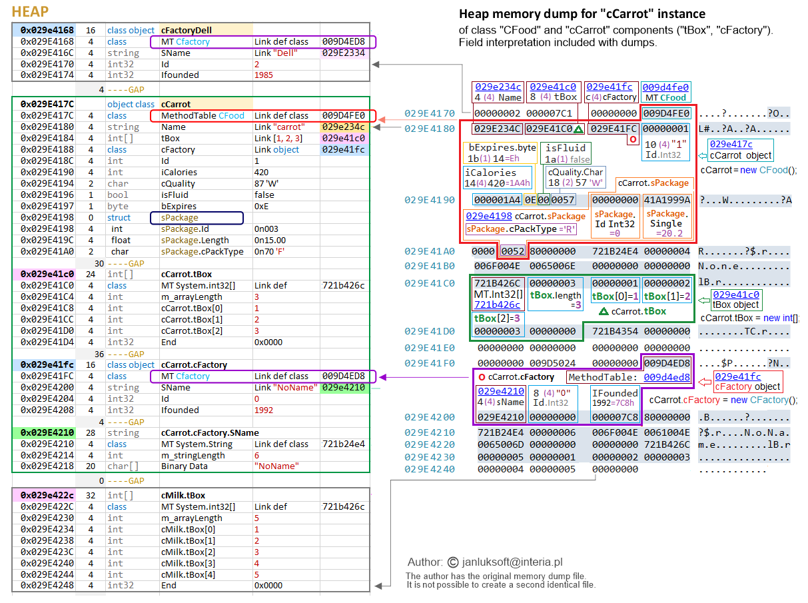
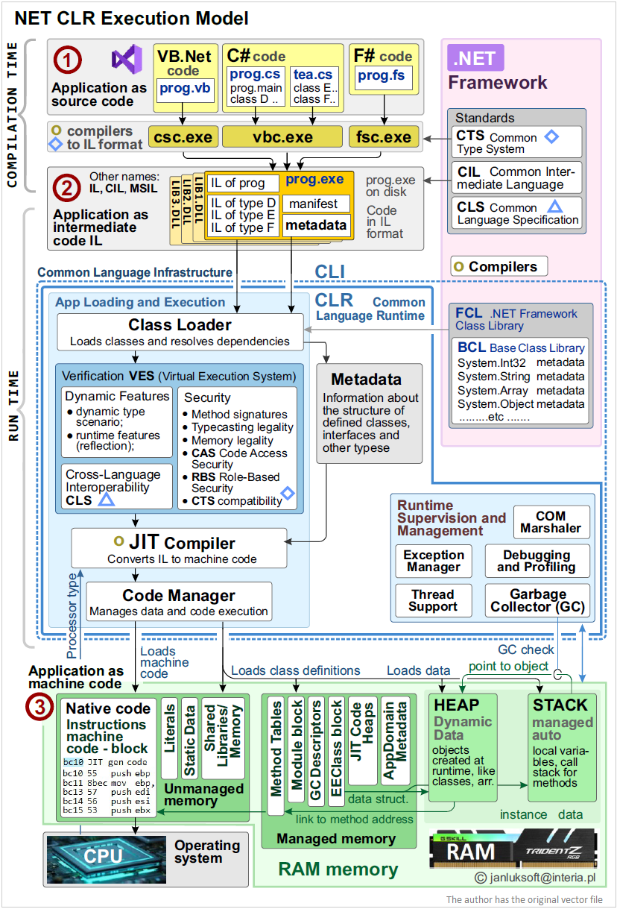

# .NET Framework CLR dump memory
## Introduction

The operation of the .NET CLR on the example of the arrangement of program elements in RAM.

In the previous chapters, the theory of operation of the .NET Framework was presented. In this chapter, it will be shown on an example of the operation of several variable classes and structure, and perhaps the theory of how the .NET Framework works in practice will be explained more.

## A dump of the memory of class and structure definitions.

To see how in RAM the CLR mechanism deploys information about classes and the machine code of their methods, it is best to look at the memory dump at the time of application execution.
For this purpose, a simple program was written in the C# language, which was run and it reached a brakepoint set near the end. A memory dump was then taken and later analyzed.

The program defines 3 simple classes, a structure, an int32[] array and several primitive variables.
The program code can be found in this thread and in Figure 7.2.
When the control stops at brakepoint all elements are initialized and can be seen distributed in RAM
The most advanced debugger Microsoft WinDbg was used for analysis.
Fig.7.1 shows information about the CFood class in RAM. In the section “RAM managed memory” you can read the full information about the class. 

 
Figure.7.1 Information about the CFood class in RAM.

## Class fields

EEClass recreates the definition of class fields in RAM. It shows the list of fields, MethodTable for each element. As you can see, simple types (such as int, bool, byte) also have their MethodTable because they are de facto structures.
When a specific instance of a class is created, a separate stack is created for it, which in the case of classes points to Heap, and there the "values" of the instance fields are put. CLR does this based on the description from EEClass and knows that in such a structure there will be all the fields in each of the many possible instances.

## Class methods

MethodTable of class CFood in the lower part contains a list of class methods. The first four exist because they are inherited from Object. The next four are methods defined in the class: 2 constructors and methods: SetPack(), Energy().
The SetPack() method is used - the JIT compiler compiled it to machine code and placed this code fragment in a separate from "RAM managed memory": "code block" 0x026 .... Through this method description - the software connects the fields of the class from Heap with the machine code of the method, which then processes the fields from the selected instance as a result of the method call.
The Energy() method is defined, but is not called anywhere, so the JIT did not compile it and you can see this information: "NONE". This is also the dynamics of the JIT compiler.

The program is contained in the cProjFood module (cProjFood.exe file). It has several classes and elements, but as a module it also has its description in the Module block.

## Instances in RAM

The above describes the definition of one CFoot class. There are more similar class and field definitions, all contained in the “RAM managed memory” block. It contains abstract data of what can be.

However, when objects/instances of classes are created, their “body” is created on the stack of their instances and on the shared Heap. So initially on the stack of instances of the “Program” function “Main()” stores its local variables and instances of classes. The sPackMain structure and the variable (int k_=14) are stored as value variables on the stack. The other fields are reference variables and only a 4-byte reference to their bodies on the Heap is stored on the stack. 
This is shown in Figure 7.2 below.

 
Figure.7.2 Class definitions and objects arrangement in memory.

In the low addresses of the 
Heap are placed string-i, further down are the classes. To check, an instance of cFactoryDell was created in the Main function and it has an address on Heap: 0x029E4168. Then when creating the CMilk instance, the cFactoryDell instance was indicated as CMilk.sPackage = cFactoryDell field. Indeed, the CMilk instance did not create a new instance on CMilk.sPackage (as happened for the cCarrot instance) but entered a pointer to an existing cFactoryDell instance (0x029E4168).
Several instances of classes are stored on Heap. For example, the cCarrot instance contains primitive type fields (int id, int iCalories, bool isFluid) but like the whole instance they are stored on Heap, not on Stack.
So you can see that both references and direct entries in the value type data work well.

The figure below, for the inquisitive, shows a raw dump of Heap memory where you can see exactly which bytes are responsible for what.

 
Figure.7.3 Heap memory dump for cCarrot instance.

## Connecting data to a method of processing them

Each instance of a class on Heap contains data but also references to its MethodTable. Based on this, searching for a MethodTable in Managed Memory, the program action binds the data to the machine code of the called method. There can be many instances of the class, which means there can be many stacks and data on Heap, but the machine code of the method is one and is bound to the data via MethodTable.

MethodTable, as you can see from the figure, has many properties not discussed here that allow the .NET Framework mechanism to work efficiently.

The screenshot shows how theory connects with practice here correctly.

## NET_CLR_execution-model

Finally, below is the NET_CLR_execution-model block diagram, which shows the RAM blocks discussed here and how they connect during the operation of the CLR mechanism.

 
Figure.6.1 NET CLR execution model.

## This chapter is part of the main project

This chapter is part of the <a href="https://github.com/janluksoft/NET_MainComparison">NET Main Comparison project</a>:  
"Comparison of software development methods from low-level methods to .NET".

